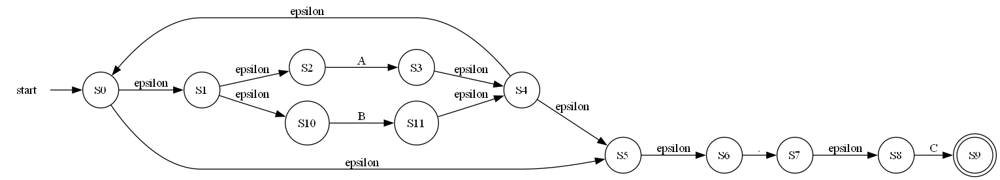
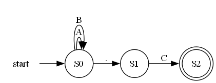
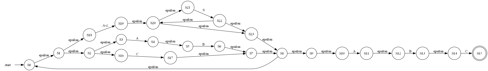
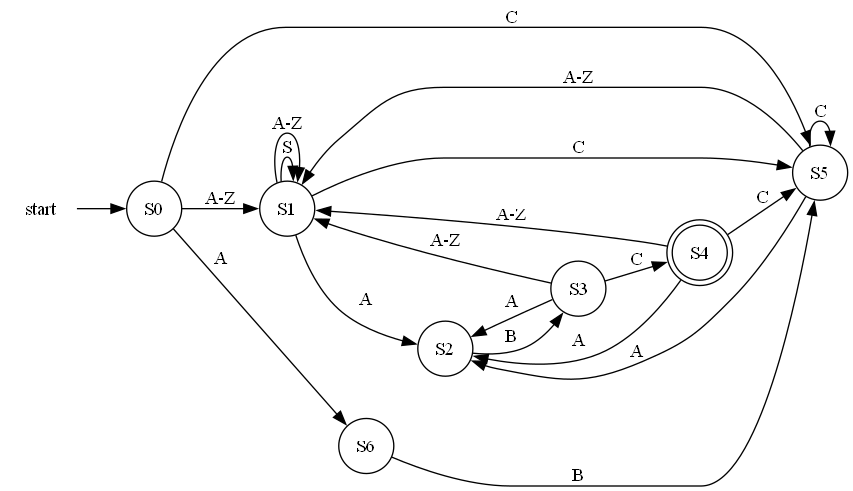

# Regex-To-NFA-And-DFA
A python application to generate NFA and minimized DFA from regex.

The application uses the Thompson's construction algorithm to generate the NFA and the subset construction algorithm to generate the DFA.

The result will be:
1. NFA graph ``nfa.png``
2. Minimized DFA graph ``dfa.png``


## Allowed Regex Operators
| Input | Description | Example | Explanation |
|-------|-------------|---------|-------------|
| \| | Or | a\|b\|c | Matches either a or b or c |
| (…) | Group | ((ABC)\|(abc)) | Matches either the first group ABC or the second group abc |
| […] | Match any character/range of characters within the bracket | [a-cA-C5] | Matches characters in the ranges a-c, A-C and 5 |
| . | Any single character | a.c | Matches any alphanumeric string of length 3 that starts with a and ends with c |
| ? | Zero or one repetition (Optional) | a? | Matches a or empty string |
| * | 0 or more repetition | A* | Matches empty string or any number of As |
| + | 1 or more repetition | A+ | Matches any number of As |

## How to run
1. Clone the repository
```bash
git clone https://github.com/SalahAbotaleb/Regex-To-NFA-And-DFA
```
2. Install the required packages
```bash
pip install graphviz
```
3. Run the application
```bash
cd src
python main.py "(A|B)*.C"
```
replace the regex with the desired one

## Options

The application will generate the NFA and minimized DFA for the given regex and save them in the output folder

You can supply the ``--output_dir`` flag to specify the output folder
```bash
python main.py "(A|B)*.C" --output_dir ../output
```

There are some examples in file ``__test_patterns__.py`` that you can run
```bash
python __test_patterns__.py
```

## Screenshots

**Regex:** ``(A|B)*.C``

**NFA**


**Minimized DFA**



regex: ``(AB|C|[A-Z]S*)+ABC``

**NFA**


**Minimized DFA**
